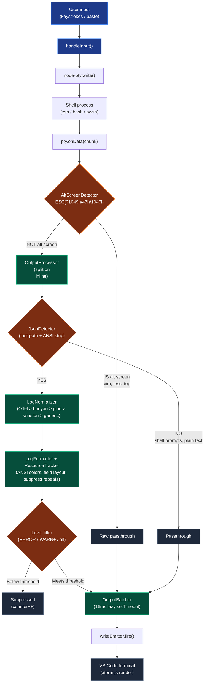

# OTel Log Beautifier

A VS Code extension that beautifies OpenTelemetry JSON structured logs directly in the integrated terminal. No piping, no separate panels, no modified run commands. Open a terminal, run your service, and JSON log lines become colorized, structured output automatically.

## Why

Raw NDJSON logs from OpenTelemetry-instrumented services are hard to scan in the terminal:

```
{"timestamp":"2026-04-12T18:26:07.864Z","level":"info","message":"Request received","severity_number":9,"severity_text":"INFO","resource":{"service.name":"auth-api"},"context":{"userId":"abc123","sessionId":"def456"}}
```

Every existing VS Code log extension (Slog Viewer, LogLens, Smart-Log, Log File Highlighter, JSON Logs) works on log files or webview panels. None intercept and reformat terminal output in place. This one does.

With beautification enabled, the same line becomes:

```
18:26:07.864  INFO  [auth-api]  Request received
    userId: abc123
    sessionId: def456
```

Non-JSON output (shell prompts, `ls`, `git status`, compiler output) passes through unchanged.

## Features

- **Automatic JSON detection and formatting** with ANSI colors
- **Multi-format support:** OTel, pino, winston, bunyan, and generic JSON logs
- **Priority chain detection:** OTel > bunyan > pino > winston > generic
- **Level-based coloring:** ERROR=red, WARN=yellow, INFO=cyan, DEBUG/TRACE=gray, FATAL=bold red
- **Resource block suppression:** repeated `service.name`/`hostname` blocks shown once, not on every line
- **Field truncation:** long values capped at 120 chars (configurable)
- **Level filtering:** `Show Only ERROR`, `Show Only WARN+`, `Show All`
- **Toggle beautification** on/off without closing the terminal
- **Alt screen buffer detection:** vim, less, top, SSH pass through unmodified (detects ESC[?1049h, ESC[?47h, ESC[?1047h)
- **Clean shutdown:** partial PTY buffers flush on toggle, deactivation kills PTY processes gracefully
- **Shared Output Channel** for diagnostic messages
- **Terminal profile:** appears in the terminal dropdown, can be set as default
- **16ms output batching** (~60fps) prevents render overhead during log bursts
- **64KB line overflow protection** prevents memory exhaustion on pathological input
- **Binary data detection** (NUL byte) bypasses the parse pipeline

## Installation

### Option A: F5 development mode (recommended for local use)

```bash
git clone git@github.com:Trimud/otel-log-beautifier.git
cd otel-log-beautifier
npm install
```

Open the project in VS Code, press **F5**. A new Extension Development Host window launches with the extension active. Use the beautified terminal there.

### Option B: Install the .vsix

```bash
npm install
npm run package
code --install-extension packages/vscode/otel-log-beautifier-0.1.0.vsix
```

**Note:** The `.vsix` build does not bundle node-pty (a native module). It falls back to `child_process.spawn`, which has limited interactive terminal support. For the best experience, use F5 mode until platform-specific builds exist.

## Usage

### One-off terminal

1. Open Command Palette (`Cmd+Shift+P` / `Ctrl+Shift+P`)
2. Run **OTel: Open Beautified Terminal**
3. Run your service — JSON log lines are automatically formatted

### Default terminal (recommended)

Set the beautified terminal as your default so every new terminal beautifies logs automatically:

1. Command Palette → **OTel: Set as Default Terminal**
2. Every new terminal (`Ctrl+\``, split terminal, task terminals) now uses the beautified version

To revert:

1. Command Palette → **OTel: Restore Default Terminal**

Non-JSON output passes through unchanged, so the beautified terminal as default has zero impact on normal shell usage.

## Commands

| Command | Description |
|---|---|
| OTel: Open Beautified Terminal | Opens a new terminal with log beautification |
| OTel: Toggle Beautify | Flip formatting on/off for all beautified terminals |
| OTel: Show Only ERROR | Filter to ERROR level only |
| OTel: Show Only WARN+ | Filter to WARN, ERROR, FATAL |
| OTel: Show All Levels | Remove level filter |
| OTel: Set as Default Terminal | Make beautified terminal the default profile |
| OTel: Restore Default Terminal | Revert to standard shell |

## Supported log formats

| Format | Detected by | Timestamp field | Level field | Message field |
|---|---|---|---|---|
| **OTel** | `severity_text` or `severity_number` | `timestamp` | `severity_text` / `severity_number` | `body` / `message` |
| **Bunyan** | `hostname` + `name` + numeric `level` | `time` (ISO) | numeric `level` (10-60) | `msg` |
| **Pino** | numeric `level` + `pid` | `time` (epoch ms) | numeric `level` (10-60) | `msg` |
| **Winston** | string `level` + `message` | `timestamp` | string `level` | `message` |
| **Generic** | fallback | `timestamp`/`time`/`ts`/`@timestamp` | `level`/`lvl`/`severity` | `message`/`msg`/`text` |

Priority order is OTel > Bunyan > Pino > Winston > Generic. A log line that could match multiple formats is classified by the most specific match.

## Architecture

Monorepo with two packages:

```
otel-log-beautifier/
  packages/
    core/                        # Pure parser/formatter, zero VS Code dependencies
      src/
        parser/
          lineBuffer.ts          # PTY chunk reassembly + binary detection
          jsonDetector.ts        # Fast-path JSON detection with ANSI stripping
          logNormalizer.ts       # 5-format detection, priority chain
        formatter/
          logFormatter.ts        # CommonLogRecord -> ANSI-colored string
          resourceTracker.ts     # Suppress repeated resource blocks (sorted keys)
          fieldLayout.ts         # Field ordering, truncation, max depth
          ansiColors.ts          # ANSI escape code constants
        types.ts                 # CommonLogRecord interface
      test/                      # 46 tests
    vscode/                      # VS Code extension wrapper
      src/
        extension.ts             # activate/deactivate, command registration
        terminal/
          beautifiedTerminal.ts  # Pseudoterminal implementation
          ptyBridge.ts           # node-pty wrapper with spawn fallback
          spawnFallback.ts       # child_process.spawn PtyLike adapter
          altScreenDetector.ts   # ESC[?1049h/47h/1047h detection
          outputProcessor.ts     # Pipeline wiring + level filter + alt screen bypass
          outputBatcher.ts       # 16ms lazy setTimeout batching
          terminalProfileProvider.ts  # Terminal dropdown integration
      test/                      # 31 tests
```

### Data flow



### Key design decisions

- **Core package has zero VS Code dependencies** — parser/formatter is pure TypeScript, fully unit-testable, and could be extracted to an npm package for CLI/CI consumers.
- **Pseudoterminal API with node-pty** — the only stable VS Code API for intercepting terminal output. Spawn fallback exists but loses TTY line discipline.
- **Partial content passes through immediately** — terminal output is NOT line-oriented. Shell prompts, cursor movements, and escape sequences arrive without trailing newlines and must render instantly.
- **Alt screen detection is critical** — without it, running `vim` or `less` would corrupt interactive program output by feeding it through the JSON parser.
- **Lazy setTimeout batching** — only schedules when buffer is non-empty. No wasted timer fires during idle.

## Development

```bash
npm install          # Install workspace dependencies + symlink node-pty for F5 mode
npm test             # Run all 77 tests (46 core + 31 vscode)
npm run build        # Build via esbuild -> packages/vscode/dist/extension.js
npm run package      # Build + vsce package -> .vsix
```

### Test framework

[Vitest](https://vitest.dev/) for both packages. Tests live alongside source:

```bash
cd packages/core && npx vitest watch       # Watch mode for core
cd packages/vscode && npx vitest watch     # Watch mode for extension
```

### TDD

All 77 tests were written test-first via strict Red-Green-Refactor. Every new module follows:

1. Write a failing test
2. Watch it fail (verify the failure is what you expected)
3. Write the minimum code to pass
4. Watch all tests pass
5. Refactor if needed, keeping tests green

### F5 debugging

`.vscode/launch.json` is configured so pressing **F5** launches an Extension Development Host with the extension active. The preLaunchTask runs `npm run build` automatically.

Debug logs from the extension go to the **Debug Console** in the development window (via `console.log`). Diagnostic messages from the extension go to the **Output** panel → "OTel Log Beautifier" channel in the host window.

## Testing

```bash
npm test
```

Expected output:

```
Test Files  10 passed (10)
     Tests  77 passed (77)
```

### What's tested

**packages/core (46 tests):**
- `LineBuffer` (9 tests) — complete lines, partial chunks, `\r\n`, 64KB overflow, binary NUL detection, manual flush
- `JsonDetector` (7 tests) — valid JSON, fast-path rejection, ANSI-wrapped JSON, array rejection, empty `{}` rejection, deep nesting safety
- `LogNormalizer` (8 tests) — OTel, pino, winston, bunyan, generic detection, priority chain tiebreaking, raw JSON preservation
- `LogFormatter` (11 tests) — level colors, field indentation, truncation, missing optional fields, TypeError catch, serviceName/traceId display
- `ResourceTracker` (5 tests) — first line display, identical suppression, key order independence (sorted stringify), undefined skip
- `FieldLayout` (6 tests) — alphabetical default order, custom order, hidden fields, maxDepth truncation, empty/undefined input

**packages/vscode (31 tests):**
- `AltScreenDetector` (9 tests) — all three alt screen sequence variants (ESC[?1049h/l, ESC[?47h/l, ESC[?1047h/l)
- `OutputProcessor` (12 tests) — JSON formatting, alt screen bypass, level filter (ERROR/WARN+/all), toggle flush, mixed content, shell prompt passthrough
- `OutputBatcher` (5 tests) — lazy setTimeout, no-op on empty, dispose flushes immediately
- `SpawnFallback` (5 tests) — stdin/stdout/stderr wiring, exit codes, kill, resize no-op

The VS Code wiring code (`beautifiedTerminal.ts`, `ptyBridge.ts`, `extension.ts`) is integration code tested manually via F5 mode.

## Troubleshooting

**Terminal appears blank / can't type**
- Check the Output panel → "OTel Log Beautifier" channel for diagnostic messages
- If using the packaged `.vsix`, node-pty isn't bundled — use F5 development mode instead

**`posix_spawnp failed` error**
- The `spawn-helper` binary in `node_modules/node-pty/prebuilds/darwin-*/` needs execute permission
- The postinstall script handles this automatically. If it didn't run: `chmod +x node_modules/node-pty/prebuilds/darwin-*/spawn-helper`

**Interactive programs (vim, less) corrupt output**
- The AltScreenDetector should bypass the parse pipeline when these programs enter alternate screen mode
- If an older program uses a non-standard sequence, file an issue with the terminal recording

**Logs not beautified**
- Verify the terminal tab name is "OTel Beautified" (not just "zsh"). If using a regular terminal, beautification won't apply.
- Check that your log output is valid NDJSON (one JSON object per line, no multi-line pretty-printing)

## Deferred work

Captured in [TODOS.md](./TODOS.md):

- **P2:** Worker thread for parse/format pipeline (profile first to confirm it's needed)
- **P3:** Copy formatted log as markdown (right-click context menu)
- **P3:** Auto-detect and offer notification (when JSON detected in default terminal)

Also planned but not yet implemented:

- Status bar indicator (ON/OFF + active filter)
- Timestamp deltas (`+Nms since previous line`)
- Clickable file paths via `TerminalLinkProvider`
- Debug mode config flag (log classification decisions to Output Channel)
- Filter status line (when level filter suppresses all output)
- Platform-specific `.vsix` builds for marketplace distribution

## Design docs

Full design process artifacts are in [`plans/`](./plans/):

- [`plans/design.md`](./plans/design.md) — Main design document (approved)
- [`plans/ceo-plan.md`](./plans/ceo-plan.md) — Scope decisions and strategic review
- [`plans/test-plan.md`](./plans/test-plan.md) — Engineering review test coverage plan

## License

MIT

## Acknowledgements

Built with [node-pty](https://github.com/microsoft/node-pty) for PTY emulation, [esbuild](https://esbuild.github.io/) for bundling, [vitest](https://vitest.dev/) for testing, and the VS Code [Pseudoterminal API](https://code.visualstudio.com/api/references/vscode-api#Pseudoterminal).

Formatter architecture informed by [pino-pretty](https://github.com/pinojs/pino-pretty). Pseudoterminal wiring reference from [ShMcK/vscode-pseudoterminal](https://github.com/ShMcK/vscode-pseudoterminal).
